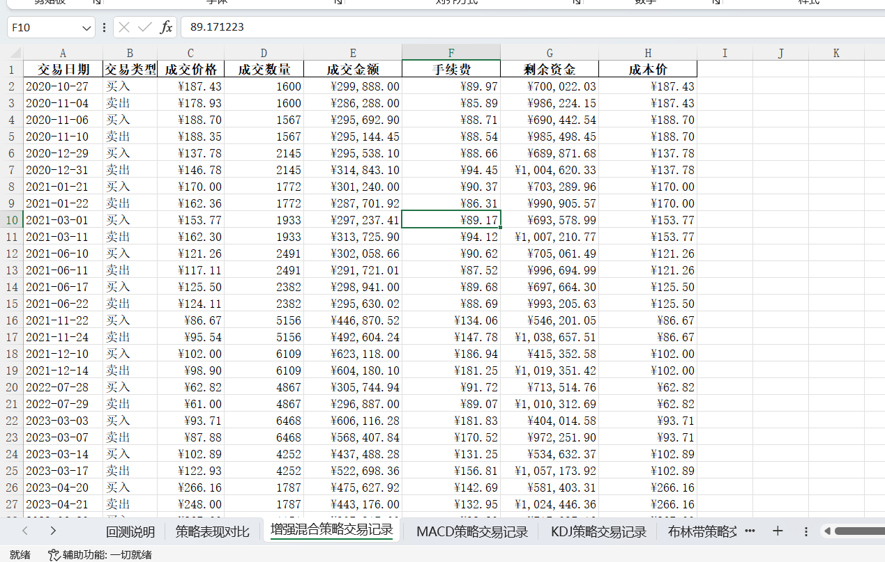

# 量化交易策略回测系统

这是一个基于Python的量化交易策略回测系统，支持多种交易策略的回测和性能对比。

## 功能特点

- 支持12种不同的交易策略
- 实时交易信息打印
- 详细的策略性能报告
- 回测结果导出到Excel
- 支持自定义初始资金和手续费率
- 完整的止损和风险管理机制

## 图片示例
 
 

## 支持的策略

1. 增强混合策略：结合多个技术指标的综合策略
2. MACD策略：基于MACD金叉死叉
3. KDJ策略：基于KDJ指标交叉
4. 布林带策略：基于布林带通道
5. 双均线量策略：结合均线和成交量
6. 均值回归策略：基于价格回归均值
7. 趋势跟踪策略：多周期趋势确认
8. 量价分析策略：成交量价格配合
9. 统计套利策略：基于统计套利模型
10. 事件驱动策略：基于量价异动
11. 质量轮动策略：多指标综合评分
12. 风险平价策略：基于风险度量

## 安装要求

```bash
pip install -r requirements.txt
```

主要依赖：
- baostock
- pandas
- numpy
- talib
- xlsxwriter

## 使用方法

```bash
python main.py <股票代码> <开始日期> <结束日期> [--capital 初始资金] [--commission 手续费率]
```

例如：
```bash
python main.py sh.600000 2023-01-01 2023-12-31 --capital 1000000 --commission 0.0003
```

参数说明：
- 股票代码：如sh.600000（上证）或sz.000001（深证）
- 开始日期：回测起始日期，格式YYYY-MM-DD
- 结束日期：回测结束日期，格式YYYY-MM-DD
- --capital：初始资金，默认100万
- --commission：手续费率，默认0.0003（0.03%）

## 输出说明

程序运行时会实时打印交易信息，包括：
- 交易日期
- 策略名称
- 交易类型（买入/卖出）
- 成交价格
- 成交数量
- 成交金额
- 剩余资金

回测结束后会生成：
1. 控制台输出：
   - 每个策略的详细表现报告
   - 收益率、交易次数、胜率等关键指标

2. Excel报告：
   - 回测说明
   - 策略表现对比
   - 每个策略的详细交易记录

## 项目结构

```
量化交易策略项目/
├── data/
│   └── data_provider.py  # 数据获取模块
├── strategies/
│   ├── base_strategy.py  # 策略基类
│   ├── macd_strategy.py  # MACD策略
│   └── ...              # 其他策略实现
├── utils/
│   └── utils.py         # 工具函数
├── main.py              # 主程序
└── README.md            # 项目说明文档
```

## 注意事项

1. 请确保有稳定的网络连接，因为需要从Baostock获取数据
2. 建议先使用小规模的时间范围进行测试
3. 回测结果仅供参考，实际交易可能会有所不同
4. 请注意控制风险，合理设置止损参数

## 开发计划(暂无动力持续开发)
主要是模拟各类散户的血泪史发展提供一个寒武纪模拟

- [ ] 添加更多技术指标
- [ ] 支持多股票组合策略
- [ ] 添加图形化界面
- [ ] 优化策略参数
- [ ] 添加机器学习策略 